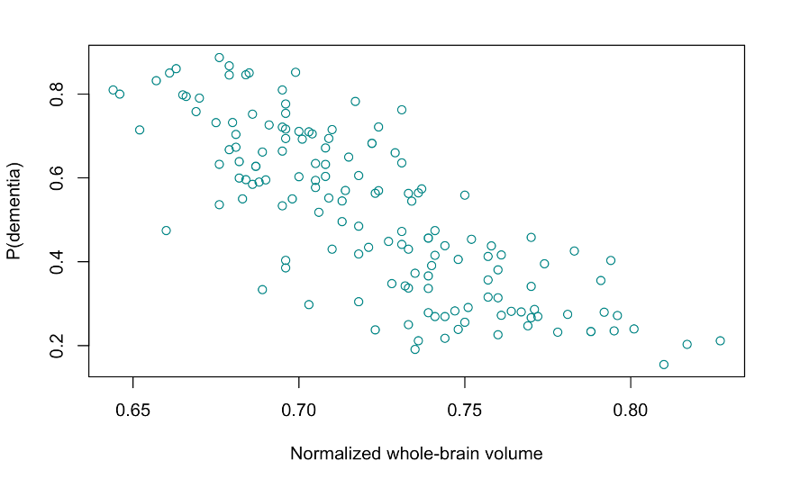
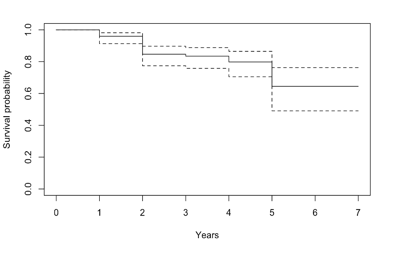

MRI-Based Prediction of Dementia with Regression and Survival Analysis
================
Joanna Shen, Ziqian Liao
2022-12-12

## **Abstract**

**Background**

Dementia is caused by damage or loss of nerve cells and their connections in the brain. Magnetic resonance imaging (MRI) has been suggested as a potential tool for predicting the onset of dementia. In this study, we aimed to develop prediction models for the onset and progression of dementia in the elderly population using multiple statistical analyses and MRI-based measures and other personal risk factors as predictors.

**Aims**

The main aim of our project is to investigate the potential of MRI-based measures in predicting the diagnosis and progression of dementia, and to examine the role of personal risk factors. We hope to gain a better understanding of the factors that may contribute to the development of dementia, and to identify potential tools and strategies for early detection and intervention.

**Methods**

In our study, we used data from the OASIS database, which includes longitudinal MRI data from 150 individuals aged 60 to 96 years, including both individuals with and without dementia. We employed a range of regression models, including linear, logistic, and Cox proportional hazards models to explore the relationships between dementia and its risk factors, including age, education, and whole-brain volume.

**Results**

It was found that the group with a 1% increase in normalized whole-brain volume (nWBV) has an odds of having dementia estimated 0.79 times the odds for population at the baseline, on average, after adjusting for quadratic age and sex. The hazards of worsened dementia for the group with relatively higher nWBV is 0.38 times the hazards for the group with relatively lower nWBV, on average.

**Conclusions**

MRI-based measures such as nWBV have been shown to be predictive of both the diagnosis and worsening of dementia, and our findings indicate that higher nWBV predicts lower risk of dementia.

**Keywords:** Dementia; Alzheimer Disease; Linear Regression; Logistic Regression; Survival Analysis

## **Introduction**

Dementia is increasingly recognized as a major source of disease burden in the United States. Of those at least 65 years of age, there are an estimated 5 million adults with dementia in 2014 and projected to be nearly 14 million by 2060. However, dementia is not an inevitable part of aging. In fact, up to 40% of dementia cases may be delayed or prevented. Thus, identification of individuals at increased risk of dementia would allow more efficient targeting of available preventive measures so that the pressure faced by the society and the healthcare system can be gradually alleviated.

When estimating the risk of dementia, it is important to take not only cerebral but also personal and societal risk factors into consideration. The aim of this project is to develop different kinds of regression models (linear regression and logistic regression) and perform survival analysis to predict the risk of onset and worsening of dementia on the basis of both MRI-based measures and personal risk factors in elderly population.

For this project, we were adopting a longitudinal dataset of 150 subjects aged 60 to 96 collected from the Open Access Series of Imaging Studies (OASIS), a project aimed at making neuroimaging datasets of the brain freely available to the scientific community. Each subject was scanned on two or more visits, separated by at least one year for a total of 373 imaging sessions. For each subject, 3 or 4 individual T1-weighted MRI scans obtained in single scan sessions are included. The subjects are all right-handed and include both men and women. 72 of the subjects were characterized as nondemented throughout the study. 64 of the included subjects were characterized as demented initially and remained so for subsequent scans, including 51 individuals with mild to moderate Alzheimer's disease (AD), as diagnosed clinically and characterized using the Clinical Dementia Rating (CDR) scale. Another 14 of the individuals were characterized as nondemented at the time of their initial visit and subsequently determined as demented at a later visit.

## **Review of Literature and Domain Expertise**

Kivipelto et al. (2006) aimed to develop a simple method for predicting the risk of late-life dementia in middle-aged individuals based on their risk profiles. Their data were drawn from the population-based CAIDE study, which included 1409 individuals who were studied in midlife and re-examined 20 years later for signs of dementia. The authors fitted several logistic regression models and examined the confounding and two-way interactions between the independentvariables. Their score values were estimated based on the β coefficients of the logistic regression. They found that occurrence of dementia during the 20 years of follow-up was 4%. Future dementia was significantly predicted by high age (≥47 years), low education (\<10 years), hypertension, hypercholesterolaemia, and obesity. Age, education, and sex were among the covariates taken into consideration in this study. By considering these factors as potential confounders or effect modifiers in our analysis, we can better understand the relationship between MRI-based measures and dementia.

In another previous study, the authors analyzed the same longitudinal dataset that we are using in our research (Marcus et al., 2010). This literature provides us with an overview of the dataset, allowing us to gain a basic understanding of the information contained in it. For instance, we have learned that of the subjects who were initially determined to be nondemented, 14 were later determined to be demented (CDR \> 0) at the time of a subsequent imaging visit. Based on this statistic, we plan to incorporate survival analysis into our project in order to further explore the relationship between MRI-based measures and the progression of dementia.

## **Research and Analysis Methods**

Our research focuses on using MRI-based measures, specifically normalized whole-brain volume (nWBV) and estimated total intracranial volume (eTIV), to predict the diagnosis and progression of dementia, and to investigate the roles of demographic factors such as age, education level, and socioeconomic status in this process. To accomplish this goal, we conducted three major statistical analyses: linear regression, logistic regression, and survival analysis.

**1. Data Preprocessing**

_1.1. Data Quality Analysis and Handling_

To ensure the accuracy and reliability of our analysis, we performed careful preprocessing of the data to identify and correct any abnormal values or inconsistencies. In this process, we discovered that two observations in the nondemented group had clinical dementia rating (CDR) values greater than 0. Since CDR is a scale used to measure the severity of dementia, a value greater than 0 would indicate that the individual has dementia. We resolved this issue by correcting the two CDR values to 0, following the original data provider's description of the data. This preprocessing step helped to ensure that our analysis is based on accurate and consistent data.

_1.2. Missing Value Analysis and Handling_

We then checked the completeness of our dataset and found missing values in two columns: socioeconomic status (SES) and Mini-Mental State Examination score (MMSE). Specifically, SES data was missing for 8 observations (5.33% of the total) and MMSE data was missing for 1 observation (0.67% of the total).

We assumed that the missingness in MMSE was completely random (MCAR), as it was impossible to identify any patterns or relationships with other covariates in the small number of cases. For the missingness in SES, we also assumed that it was completely random (MCAR), as there was no statistically significant predictor after regressing the missingness indicator on covariates. Although it is impossible todefinitively test the assumption for MCAR in both cases, we believe that it is the most likely scenario given the evidence.

We decided that the missing observation in the MMSE column was not a problem for our analysis, as MMSE is not relevant to our research objectives and should be excluded from the analysis. Furthermore, given the strong negative linear correlation between SES and education level (EDUC) (r = -0.68), we also decided to omit the SES column and continue with EDUC in model building.

_1.3. Data Wrangling_

We generated two different datasets from the original table to support the requirements of different statistical analyses:

- The individual-level dataset was created by collapsing the records of each individual's visits into a single record. Only the data collected during the last visit of an individual was included. This dataset will be used for linear and logistic regression analysis.
- The survival outcome dataset contained all MRI-based data and demographic information, plus two additional columns indicating whether or not an event (worsening of clinical dementia rating) occurred during the observation period and the time span in years, calculated from the difference in age on records collected from multiple visits of the same individual. This dataset will be used for survival analysis.

**2. Statistical Analysis and Modeling**

_2.1. Uncovering the Relationship between Normalized Whole-Brain Volume and Age_

The link between brain aging and age is a well-known and extensively studied phenomenon. Previous research using magnetic resonance imaging (MRI) data has shown that aging is associated with a decline in global and regional brain volumes (Scahill et al., 2003). If this association holds in our dataset, we need to consider the potential confounding effect of age on the relationship between normalized whole-brain volume (nWBV) and dementia.

To investigate this association, we built a linear regression model with age as the predictor variable and nWBV as the outcome variable. After evaluating the validity of our models with diagnostic plots, we compared the performance of three different regression methods: a simple linear model, a quadratic model, and a cubic model. The results of our analysis of variance (ANOVA) showed that the quadratic model outperformed the simple linear model (p = 0.04099 \< 0.05), while the cubic model failed to provide significant improvement over the quadratic model (p = 0.5019 ≥ 0.05). Additionally, the quadratic model had the lowest AIC and the largest adjusted R2 (table 1), indicating a better fit than the other candidates.

Table 1. Linear age, quadratic age, and cubic age models comparison with AIC and adjusted R2

| Model | AIC | Adjusted R2 |
| --- | --- | --- |
| Linear age | -592.70 | 0.25401 |
| Quadratic age | -594.97 | 0.27005 |
| Cubic age | -593.44 | 0.26732 |

Therefore, we selected the quadratic model as the final model for the relationship between nWBV and age. Our final model is thus

.

The final model suggests a statistically significant relationship between quadratic age and nWBV (p = 0.0410 \< 0.05).

_2.2. Predicting Dementia with MRI-based Measures and Demographic Statistics_

We sought to investigate the potential for MRI-based measures to predict a dementia diagnosis and to determine the potential influence of demographic factors on this prediction. To do so, we employed multiple logistic regression models with dementia diagnosis (coded as 0 for no dementia and 1 for dementia) as the dependent variable and MRI-based measures and demographic information as predictors. We then compared the performance of these models.

To identify which MRI-based measures should be included in our predictive model, we considered two measures present in our dataset: normalized whole-brain volume (nWBV) and estimated total intracranial volume (eTIV). We fit two models, each including one of these measures as a predictor, as well as a third model that included both measures. We found that the model with nWBV as a single predictor performed the best, as indicated by the lowest Akaike Information Criterion (AIC) among the three models (table 2). We further confirmed this conclusion by performing an analysis of variance (ANOVA) to compare the model with nWBV only and the model with both nWBV and eTIV. The resulting p-value (p = 0.3226 ≥ 0.05) also favored the model with nWBV as the sole predictor.

Table 2. Comparison of models using eTIV, nWBV, or eTIV plus nWBV with AIC

| Model | AIC |
| --- | --- |
| eTIV | 211.83 |
| nWBV | 196.76 |
| eTIV + nWBV | 197.78 |

In the next step of our analysis, we sought to determine the best way to represent the information provided by the nWBV measure in our logistic regression models. To do so, we fitted multiple models using the nWBV measure in its categorical, ordinal, and original continuous forms and compared their performance based on AIC values (table 3).

Table 3. Comparison of models using categorical, ordinal, or continuous nWBV with AIC

| Model | AIC |
| --- | --- |
| Categorical | 201.75 |
| Ordinal | 198.97 |
| Continuous | 196.76 |

The model using the continuous form of nWBV had the lowest AIC, indicating the best performance among the three. After that, we compared the performance of models that included nWBV in its linear, quadratic, and cubic forms, again using AIC values (table 4), and found that the simple linear form provided the best fit.

Table 4. Linear nWBV, quadratic nWBV, and cubic nWBV models comparison with AIC

| Model | AIC |
| --- | --- |
| Linear nWBV | 196.76 |
| Quadratic nWBV | 198.76 |
| Cubic nWBV | 200.76 |

To further consider the potential effects of sex, age, and level of education on the relationship between dementia and nWBV, we reviewed previous studies on these factors. Previous research has shown that female sex is associated with an increased risk of developing Alzheimer's disease (Azad et al., 2007), and our analysis of boxplots of nWBV versus sex and dementia versus sex suggests that sex may be a risk factor for dementia and may be associated with nWBV, but not a consequence of it. Therefore, sex could be considered a confounder with respect to the relationship between nWBV and dementia by the classical definition of a confounder. Similarly, previous studies have suggested that the level of education is a risk factor for dementia (Ravaglia et al., 2002), and our analysis of the data showed a similar relationship. Furthermore, our analysis in the previous section indicated that age also satisfies the classical definition of a confounder, given that both previous research and our data suggest that age is a risk factor for dementia and is associated with nWBV, but not a consequence of it. Therefore, age, sex, and level of education are three potential confounders that should be further assessed.

To determine whether sex, age, and level of education should be considered confounders or effect modifiers in our analysis, we fitted separate models that included these variables and compared their performance to the original model. The inclusion of sex and quadratic age resulted in a 11.60% and -30.13% change in the model coefficients, respectively, which were above the threshold of 10%. This suggested that we should consider both of these variables as confounders in our next steps. We also examined whether these variables should be included as effect modifiers by including interaction terms in the models and comparing the modified models to the original one. The results showed that none of the three variables modified the effect, so we did not include interaction terms in our final model.

Based on our analysis, we decided on the following logistic regression model for predicting dementia:

.

This model takes into account the effects of sex and quadratic age as potential confounders and provides the best fit for the data according to our evaluation criteria. We used the model to visualize how probability of dementia is associated with nWBV (figure 1).

Figure 1. Scatterplot showing the estimated relationship between probability of dementia and nWBV resulted from the logistic regression model

_2.3. Survival Analysis of Dementia Progression_

In addition to the analysis we conducted to investigate the relationship between nWBV and dementia, we also aimed to investigate the potential of MRI-based measures to predict the progression of dementia, as defined by an increase in clinical dementia rating (CDR) in a subsequent patient visit. To achieve our objective, we used a survival analysis approach and considered the worsening of dementia as the target event. We computed the observation period for each patient by measuring their change in age on records of their multiple visits. We used the data to calculate and plot the Kaplan-Meier estimate of the survival function (figure 2).

Figure 2. Kaplan-Meier survival curve showing the estimated survival probability 

To prepare our data for building the Cox proportional hazards regression model, we dichotomized the study population based on their nWBV with the threshold at the median value of 0.7125. After fitting the model, we examined the diagnostic plots to ensure that the assumption of proportional hazards held. We first generated the log-log plot and found that the two lines were roughly parallel, indicating that the hazards were proportional. We also examined the weighted Schoenfeld residuals and obtained a large p-value, which is evidence that the model is valid. The plot also shows no pattern of changing residuals for that covariate, further confirming the validity of our model.

Based on our analysis, we decided on the following model for survival analysis:

.

The final model suggests that the contribution by nWBV on the hazard of dementia progression was statistically significant (p = 0.0136 \< 0.05), with lower nWBV suggesting higher likelihood of worsened dementia.

## **Findings and Analysis**

Based on the final logistic regression model we derived, we may conclude that the group with a 1% increase in normalized whole-brain volume (nWBV) has an odds of having dementia estimated 0.79 times the odds for population at the baseline, on average, after adjusting for quadratic age and sex. A p-value of 0.000113 shows statistical significance at the 0.05 threshold, indicating a strong association between nWBV and dementia.The confidence interval of (0.71, 0.89) suggests that we are 95% confident that the true odds ratio for the population will fall within this range. This outcome provides evidence that lower nWBV may be associated with a higher risk of dementia.

The Cox proportional hazard model suggests that the hazards of worsened dementia for the group with nWBV greater or equal to 0.7125 is 0.38 times the hazards for the group with nWBV lower than 0.7125, on average. A p-value of 0.0136 shows statistical significance at the 0.05 threshold. This outcome provides evidence that for an individual with nWBV lower than the median, the hazards of deterioration of dementia would be much higher.

## **Discussion**

Our statistical analyses show that the MRI-based measure of nWBV is predictive of both the diagnosis and worsening of dementia, with higher nWBV having a protective effect. The logistic model also reveals that personal risk factors such as age and sex can confound the relationship between nWBV and dementia. These findings are consistent with previous research on this topic, as discussed in our literature review section.

Although our study is preliminary, it sheds light on how MRI-based measures can be used to predict dementia and provides direction on how to address the problem in communities with a high prevalence of dementia. Our findings suggest that implementing MRI-based measures in clinical practice could help to identify individuals at risk for dementia and allow for early intervention and prevention efforts.

In conclusion, we urge seniors with suspected symptoms to seek early medical attention and undergo an MRI to screen for the risk of dementia. Additionally, we recommend that individuals with dementia undergo regular MRI scans to track the progression of the disease.

## **Limitations**

Although we made a concerted effort to strengthen our argument, there are limitations to our study that should be acknowledged. Firstly, a significant proportion of our survival data was right-censored, meaning that many individuals were not observed until their dementia worsened. In particular, the dataset had a censor rate of 80%. This could impact the accuracy and effectiveness of our analysis.

Moreover, the time data lacks precision. While the dataset did not include time spans and the exact time point at which the deterioration took place, we used an indirect approach to derive these statistics from data available. However, this approach had drawbacks: First, the exact time point at which the patient's dementia worsened must have been prior to the time point when the patient was found to have a higher CDR score during a visit, whereas the best we could do was to approximate the time with the time of the closest next visit. Second, the observation period was only measured with integer precision because it was derived by calculating the age difference on multiple records of a single patient. This resulted in a lack of granularity in the time variable, which is critical to survival analysis.

## **Future Scope**

While the use of regression methods to explore the risk factors of dementia has been extensively studied, relatively few studies have employed survival analysis. However, our analysis, though far from perfect, suggests that this approach holds high potential and value. In light of the limitations mentioned in the previous section, we recommend that future research be conducted using data collection mechanisms specifically designed for survival analysis. For example, researchers may extend the observation period and collect more data from each individual to provide a more complete picture of dementia progression. To improve the precision of the analysis, researchers may also encourage patients to visit more frequently and collect more detailed information at each visit.

We hope that our study will inspire further research on this topic. The more we understand about dementia, the greater our chances are for preventing and delaying its onset.

## References

Azad, N. A., Al Bugami, M., & Loy-English, I. (2007). Gender differences in dementia risk factors. _Gender Medicine_, _4_(2), 120–129. [https://doi.org/10.1016/s1550-8579(07)80026-x](https://doi.org/10.1016/s1550-8579(07)80026-x)

Kivipelto, M., Ngandu, T., Laatikainen, T., Winblad, B., Soininen, H., & Tuomilehto, J. (2006). Risk score for the prediction of dementia risk in 20 years among middle aged people: a longitudinal, population-based study. _The Lancet Neurology_, _5_(9), 735–741. [https://doi.org/10.1016/s1474-4422(06)70537-3](https://doi.org/10.1016/s1474-4422(06)70537-3)

Marcus, D. S., Fotenos, A. F., Csernansky, J. G., Morris, J. C., & Buckner, R. L. (2010). Open Access Series of Imaging Studies: Longitudinal MRI Data in Nondemented and Demented Older Adults. _Journal of Cognitive Neuroscience_, _22_(12), 2677–2684. [https://doi.org/10.1162/jocn.2009.21407](https://doi.org/10.1162/jocn.2009.21407)

Ravaglia, G., Forti, P., Maioli, F., Sacchetti, L., Mariani, E., Nativio, V., Talerico, T., Vettori, C., & Macini, P. L. (2002). Education, Occupation, and Prevalence of Dementia: Findings from the Conselice Study. _Dementia and Geriatric Cognitive Disorders_, _14_(2), 90–100. [https://doi.org/10.1159/000064930](https://doi.org/10.1159/000064930)

Scahill, R. I., Frost, C., Jenkins, R., Whitwell, J. L., Rossor, M. N., & Fox, N. C. (2003). A Longitudinal Study of Brain Volume Changes in Normal Aging Using Serial Registered Magnetic Resonance Imaging. Archives of Neurology, 60(7), 989. [https://doi.org/10.1001/archneur.60.7.989](https://doi.org/10.1001/archneur.60.7.989)
