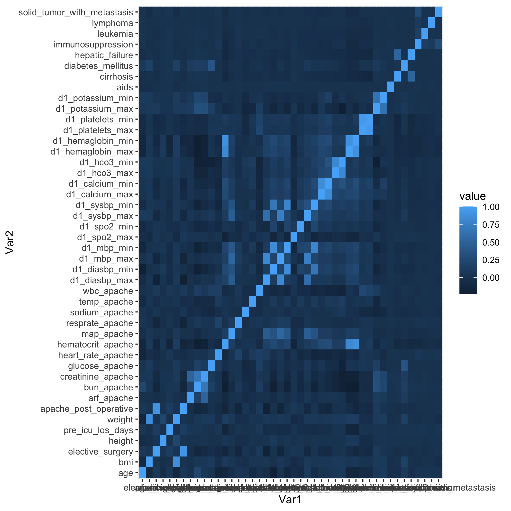
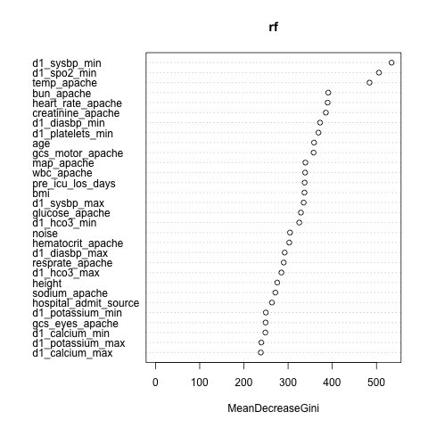
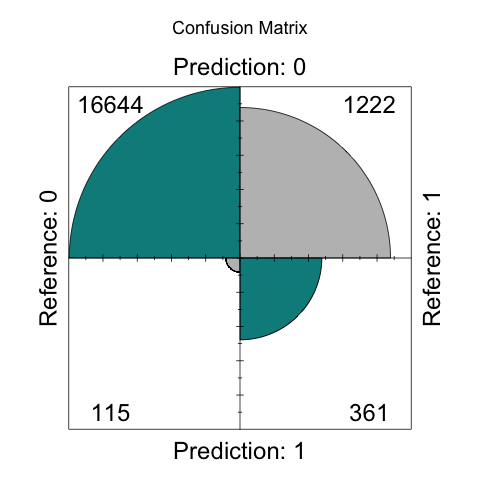
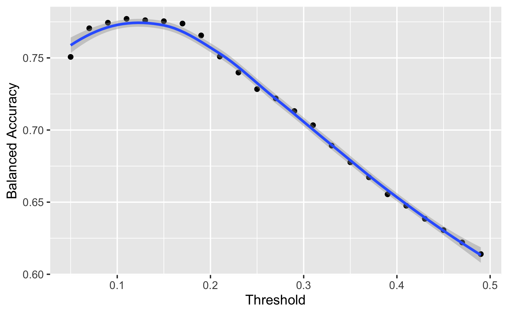
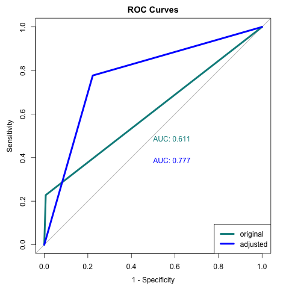

Prediction of Patient Survival with ICU Data
================
Ziqian Liao
2022-12-04

## Introduction

#### Background

Intensive care unit (ICU) stays are a crucial period in the treatment of
critically ill patients, as the care provided during this time can have
a significant impact on patient outcomes. Predicting patient survival
during the ICU stay is important for both clinical decision making and
resource allocation. However, accurately predicting patient survival can
be challenging, as it depends on a complex interplay of factors
including the patient’s underlying health, the severity of their
condition, and the quality of the care they receive. In this paper, we
present a machine learning model that uses data from the first 24 hours
of ICU stays to predict patient survival. The dataset is originally
owned by MIT GOSSIS Initiative and made publicly available for Global
Women in Data Science (WiDS) Datathon 2020 by the Global WiDS team at
Stanford, the West Big Data Innovation Hub, and the WiDS Datathon
Committee. It contains more than 130,000 hospital Intensive Care Unit
(ICU) visits from patients over a one-year timeframe, collected from
hospitals around the globe. For this study, we use a subset with 73371
observations and 57 features (after handling missingness with data
wrangling) to complete the task.

#### Exploratory Data Analysis

The first step of data pre-processing was to drop columns with unrelated
or duplicated information. After that, we obtained a clean dataset to
proceed with.

There were missing values in several columns of the dataset, as shown in
*Table 1*. To address this issue, we first dropped all columns with more
than 50% missingness and performed imputation based on our domain
knowledge. For example, when imputing a measure that resulted in the
highest APACHE III score (indicating the highest mortality risk), we
compared the minimum and maximum values over the time period and
selected the value that was furthest from the safe level. In other
cases, we found that when a patient did not undergo a test, it was often
because the attending staff did not believe it was necessary. In such
cases, we chose an average safe level for imputation. After performing
imputation, we dropped columns carrying duplicated information.

Several of the predictors in the dataset were highly correlated, as
depicted in *Figure 1*. To mitigate the risk of collinearity, which can
decrease the model’s performance, we decided to remove certain columns
with similar contributions.

#### Methodology

Random forest is a strong candidate for building a machine learning
model that uses data from the first 24 hours of ICU stays to predict
patient survival for two reasons. First, random forest is a robust and
reliable machine learning algorithm that has been widely used for a
variety of prediction tasks. It is particularly well-suited for tasks
involving high-dimensional data, such as the data collected in an ICU
setting. Second, random forest is an ensemble method, which means that
it combines the predictions of multiple decision trees to make a final
prediction. This can help to reduce the overfitting and can improve the
generalization performance of the model. The other major analysis
approach we took is cross-validation. Cross-validation is a widely used
technique for evaluating the performance of machine learning models. It
involves dividing the data into a number of folds, training the model on
a subset of the data, and evaluating the model’s performance on the
remaining data. By training and evaluating models on different subsets
of the data, cross validation helps make sure that the model is not
overly tailored to the training data, resulting in improved robustness
and model generalizability.

## Results

In the modeling process, we employed two major analyses: Random forest
for both feature selection and final model building, and 5-fold
cross-validation for parameter tuning.

#### Feature Selection

To reduce the computational cost and prevent overfitting, we applied
feature selection before building the model to reduce its
dimensionality. We used random forest to determine the contribution of
each covariate and created a new column called `noise` by generating
random numbers to form a baseline for comparison. The mean decrease in
Gini when excluding one of the variables is shown in *Figure 2*. This
showed that many predictors had contributions below the baseline formed
by `noise` and were therefore not significantly important in prediction.
Based on this information, we removed these predictors.

#### Parameter Tuning

To optimize the performance of our random forest model, we used a 5-fold
cross-validation technique and explored a range of values for the `mtry`
hyperparameter, which determines the number of variables randomly
sampled as candidates at each split. The dataset was divided into 5
folds, after which the model was trained on 4 folds and tested on the
remaining fold, and this process was repeated 5 times with each fold
serving as the validation set once. The performance of the model was
then averaged across all 5 iterations to give a final evaluation of the
model’s performance. We repeated the procedure with 6 different values
of `mtry` and evaluated the model performance.

After analyzing the results, we found that the model achieved its
highest accuracy when `mtry` was set to 5 (as shown in *Figure 3*).
Therefore, we will use this value of `mtry` in subsequent model building
efforts.

#### Model Fitting

Based on our analysis, we determined that using an `mtry` value of 5
would yield the best performance for our random forest model. As such,
we decided to fit the final model using the remaining predictors after
filtering, and using an `mtry` value of 5. This configuration should
provide us with the most accurate predictions. According to the summary
statistics shown in *Table 2*, the model resulted in an accuracy of
0.9271 when applied on the separate test set, suggesting pretty good
model performance with the current metric.

Although the overall performance of our model is satisfactory, it is not
optimal for the specific goal of identifying patients with the highest
mortality risk, particularly among positive cases. This is evident from
the confusion matrix shown in *Figure 4*, which indicates that the
model’s performance is less satisfactory in this regard. To better meet
this objective, we will need to make further adjustments to the model.

#### Adjusting Classification Threshold

To address the issue of identifying patients with the highest mortality
risk, we considered adjusting the classification threshold of our random
forest model. By default, the model classifies cases as positive or
negative based on a threshold of 0.5. However, we can choose a different
threshold in order to capture more positive cases, even though this may
come at the cost of overall accuracy.

To evaluate the impact of different threshold values on our model’s
performance, we used the balanced accuracy metric, which is defined as
the arithmetic mean of sensitivity and specificity. After experimenting
with a range of threshold values and calculating the balanced accuracy
for each, we found that the highest balanced accuracy was achieved with
a threshold of 0.11 (as shown in *Figure 5*). This means that for any
case with a predicted risk of death greater than 0.11, we classify the
case as positive (i.e., predicting mortality). The confusion matrix for
the model with this new threshold is shown in *Figure 6*, which
demonstrates that the balanced prediction accuracy has significantly
improved from 0.61 to 0.77, although this comes at the expense of a
decreased overall accuracy of 0.77.

In addition to comparing the confusion matrices of the two models, we
also compared their ROC curves to evaluate their performance. The ROC
curve is a graphical representation of the true positive rate
(sensitivity) on the y-axis and the false positive rate (1 -
specificity) on the x-axis, and the area under the curve (AUC) is a
measure of the model’s overall accuracy. After comparing the ROC curves
of the two models, we found that the model with the threshold set at
0.11 had a better ROC curve, as it was able to more accurately
distinguish between the two classes being predicted (as shown in *Figure
7*). Therefore, we selected this model as the final model for our
analysis.

## Conclusion

#### Summary of Findings

We developed a model to predict the mortality of patients in the ICU
within the first 24 hours of their stay using random forest and 5-fold
cross-validation. We carefully imputed missing data in order to preserve
as much information as possible from the dataset. We also engaged in
extensive data wrangling and feature selection to reduce the risk of
overfitting and ensure that the model remained robust with new inputs.
Our final model identified 17 predictors that were significantly
associated with mortality, with systolic blood pressure, peripheral
oxygen saturation, and body temperature being the most influential. With
these inputs, we were able to build a random forest model with a test
accuracy of 0.9271, or an adjusted model with a balanced test accuracy
of 0.77.

Our results demonstrate the potential of using machine learning models
to guide the allocation of medical resources. This information can be
valuable to healthcare providers as they make decisions about the care
and treatment of patients in the ICU. By utilizing these models, it may
be possible to improve patient outcomes and optimize resource
utilization in the healthcare setting.

#### Future Scope

Overall, the task was successfully achieved as the model did pretty well
making predictions on patient mortality, as proven by the model outcome.
However, there were still limitations we would have to acknowledge.

One potential way to improve the current model would be to consider
alternative modeling approaches for comparison and integration. There
are many different machine learning algorithms that can be used for
supervised classification tasks, such as K-nearest neighbors (KNN),
support vector machines (SVMs), and gradient boosting. By exploring
these other approaches, it may be possible to identify a method that
provides better predictions or to build an ensemble model by integrating
two or more different approaches. This could help to further improve the
performance of the model.

Another way to further enhance model performance would be to run the
model on the cloud or in parallel to take advantage of more advanced
computing power. This could allow more explorations on the modeling.
This could enable further exploration of the modeling process, such as
the inclusion of additional variables for prediction or more extensive
parameter tuning. While most of the variables were removed considering
duplicated information they carried or too many missing observations,
the information provided by some of the columns were integrated during
the data cleaning for the sake of computational simplicity. For example,
the maximum and minimum measures of vital signs may be replaced by one
single column of the value of the measure that has resulted in the
highest APACHE III score. By using more advanced computing resources, it
may be possible to incorporate these variables in the model, potentially
leading to improved predictions. Moreover, more advanced computing power
may also allow more extensive exploration of parameter tuning. Exploring
hyperparameters like `ntree` in addition to `mtry` could help to improve
the robustness and accuracy of the model.

## References

The WiDS Datathon Committe. (n.d.). ICU patient records dataset.
Retrieved from
<https://www.kaggle.com/competitions/widsdatathon2020/data>

## Appendix

#### Figures and Tables

    ##                             case_missing proportion_missing
    ## hospital_death                         0        0.000000000
    ## age                                 4228        0.046100335
    ## bmi                                 3429        0.037388375
    ## elective_surgery                       0        0.000000000
    ## ethnicity                              0        0.000000000
    ## gender                                 0        0.000000000
    ## height                              1334        0.014545375
    ## hospital_admit_source                  0        0.000000000
    ## icu_admit_source                       0        0.000000000
    ## icu_stay_type                          0        0.000000000
    ## icu_type                               0        0.000000000
    ## pre_icu_los_days                       0        0.000000000
    ## readmission_status                     0        0.000000000
    ## weight                              2720        0.029657737
    ## albumin_apache                     54379        0.592925758
    ## apache_post_operative                  0        0.000000000
    ## arf_apache                           715        0.007796059
    ## bilirubin_apache                   58134        0.633868699
    ## bun_apache                         19262        0.210024751
    ## creatinine_apache                  18853        0.205565187
    ## fio2_apache                        70868        0.772714882
    ## gcs_eyes_apache                     1901        0.020727705
    ## gcs_motor_apache                    1901        0.020727705
    ## gcs_unable_apache                   1037        0.011307012
    ## gcs_verbal_apache                   1901        0.020727705
    ## glucose_apache                     11036        0.120331905
    ## heart_rate_apache                    878        0.009573343
    ## hematocrit_apache                  19878        0.216741356
    ## intubated_apache                     715        0.007796059
    ## map_apache                           994        0.010838158
    ## paco2_apache                       70868        0.772714882
    ## paco2_for_ph_apache                70868        0.772714882
    ## pao2_apache                        70868        0.772714882
    ## ph_apache                          70868        0.772714882
    ## resprate_apache                     1234        0.013455017
    ## sodium_apache                      18600        0.202806581
    ## temp_apache                         4108        0.044791905
    ## urineoutput_apache                 48998        0.534253595
    ## ventilated_apache                    715        0.007796059
    ## wbc_apache                         22012        0.240009595
    ## d1_diasbp_max                        165        0.001799091
    ## d1_diasbp_min                        165        0.001799091
    ## d1_heartrate_max                     145        0.001581019
    ## d1_heartrate_min                     145        0.001581019
    ## d1_mbp_max                           220        0.002398788
    ## d1_mbp_min                           220        0.002398788
    ## d1_resprate_max                      385        0.004197878
    ## d1_resprate_min                      385        0.004197878
    ## d1_spo2_max                          333        0.003630892
    ## d1_spo2_min                          333        0.003630892
    ## d1_sysbp_max                         159        0.001733669
    ## d1_sysbp_min                         159        0.001733669
    ## d1_temp_max                         2324        0.025339919
    ## d1_temp_min                         2324        0.025339919
    ## d1_albumin_max                     49096        0.535322146
    ## d1_albumin_min                     49096        0.535322146
    ## d1_bilirubin_max                   53673        0.585227830
    ## d1_bilirubin_min                   53673        0.585227830
    ## d1_bun_max                         10514        0.114640236
    ## d1_bun_min                         10514        0.114640236
    ## d1_calcium_max                     13069        0.142498882
    ## d1_calcium_min                     13069        0.142498882
    ## d1_creatinine_max                  10169        0.110878501
    ## d1_creatinine_min                  10169        0.110878501
    ## d1_glucose_max                      5807        0.063317087
    ## d1_glucose_min                      5807        0.063317087
    ## d1_hco3_max                        15071        0.164327849
    ## d1_hco3_min                        15071        0.164327849
    ## d1_hemaglobin_max                  12147        0.132445782
    ## d1_hemaglobin_min                  12147        0.132445782
    ## d1_hematocrit_max                  11654        0.127070317
    ## d1_hematocrit_min                  11654        0.127070317
    ## d1_inr_max                         57941        0.631764308
    ## d1_inr_min                         57941        0.631764308
    ## d1_lactate_max                     68396        0.745761233
    ## d1_lactate_min                     68396        0.745761233
    ## d1_platelets_max                   13444        0.146587725
    ## d1_platelets_min                   13444        0.146587725
    ## d1_potassium_max                    9585        0.104510811
    ## d1_potassium_min                    9585        0.104510811
    ## d1_sodium_max                      10195        0.111161994
    ## d1_sodium_min                      10195        0.111161994
    ## d1_wbc_max                         13174        0.143643758
    ## d1_wbc_min                         13174        0.143643758
    ## d1_arterial_pco2_max               59271        0.646266069
    ## d1_arterial_pco2_min               59271        0.646266069
    ## d1_arterial_ph_max                 60123        0.655555919
    ## d1_arterial_ph_min                 60123        0.655555919
    ## d1_arterial_po2_max                59262        0.646167937
    ## d1_arterial_po2_min                59262        0.646167937
    ## d1_pao2fio2ratio_max               66008        0.719723485
    ## d1_pao2fio2ratio_min               66008        0.719723485
    ## aids                                 715        0.007796059
    ## cirrhosis                            715        0.007796059
    ## diabetes_mellitus                    715        0.007796059
    ## hepatic_failure                      715        0.007796059
    ## immunosuppression                    715        0.007796059
    ## leukemia                             715        0.007796059
    ## lymphoma                             715        0.007796059
    ## solid_tumor_with_metastasis          715        0.007796059
    ## apache_3j_bodysystem                   0        0.000000000

Table 1: Summary of Missing Data






    ## $positive
    ## [1] "0"
    ## 
    ## $table
    ##           Reference
    ## Prediction     0     1
    ##          0 16644  1222
    ##          1   115   361
    ## 
    ## $overall
    ##       Accuracy          Kappa  AccuracyLower  AccuracyUpper   AccuracyNull 
    ##   9.271072e-01   3.236674e-01   9.232497e-01   9.308286e-01   9.136953e-01 
    ## AccuracyPValue  McnemarPValue 
    ##   1.875732e-11  5.628323e-201 
    ## 
    ## $byClass
    ##          Sensitivity          Specificity       Pos Pred Value 
    ##            0.9931380            0.2280480            0.9316019 
    ##       Neg Pred Value            Precision               Recall 
    ##            0.7584034            0.9316019            0.9931380 
    ##                   F1           Prevalence       Detection Rate 
    ##            0.9613863            0.9136953            0.9074256 
    ## Detection Prevalence    Balanced Accuracy 
    ##            0.9740486            0.6105930 
    ## 
    ## $mode
    ## [1] "sens_spec"
    ## 
    ## $dots
    ## list()
    ## 
    ## attr(,"class")
    ## [1] "confusionMatrix"

Table 2: Summary Statistics for the Random Forest Model





    ## $positive
    ## [1] "0"
    ## 
    ## $table
    ##           Reference
    ## Prediction     0     1
    ##          0 13024   353
    ##          1  3735  1230
    ## 
    ## $overall
    ##       Accuracy          Kappa  AccuracyLower  AccuracyUpper   AccuracyNull 
    ##      0.7771235      0.2816722      0.7710298      0.7831294      0.9136953 
    ## AccuracyPValue  McnemarPValue 
    ##      1.0000000      0.0000000 
    ## 
    ## $byClass
    ##          Sensitivity          Specificity       Pos Pred Value 
    ##            0.7771347            0.7770057            0.9736114 
    ##       Neg Pred Value            Precision               Recall 
    ##            0.2477341            0.9736114            0.7771347 
    ##                   F1           Prevalence       Detection Rate 
    ##            0.8643483            0.9136953            0.7100643 
    ## Detection Prevalence    Balanced Accuracy 
    ##            0.7293098            0.7770702 
    ## 
    ## $mode
    ## [1] "sens_spec"
    ## 
    ## $dots
    ## list()
    ## 
    ## attr(,"class")
    ## [1] "confusionMatrix"

Table 3: Summary Statistics for the Random Forest Model with Adjusted
Threshold




#### Code

``` r
library(tidyr)
library(caret)
library(Boruta)
library(dplyr)
df_orig <- read.csv('widsdatathon2020/training_v2.csv')
#get orig version data 
df <- df_orig 
#### Cleaning
#Drop id columns we will not need
df <- df_orig %>% select(-c(encounter_id, patient_id, hospital_id, icu_id))

#Correct data types to make more sense
df$hospital_death <- factor(df$hospital_death)
df$ethnicity <- factor(df$ethnicity)
df$gender <- factor(df$gender)
df$hospital_admit_source <- factor(df$hospital_admit_source)
df$icu_admit_source <- factor(df$icu_admit_source)
df$icu_stay_type <- factor(df$icu_stay_type)
df$icu_type <- factor(df$icu_type)
df$apache_3j_diagnosis <- factor(df$apache_3j_diagnosis)
df$gcs_eyes_apache <- factor(df$gcs_eyes_apache)
df$gcs_motor_apache <- factor(df$gcs_motor_apache)
df$gcs_unable_apache <- factor(df$gcs_unable_apache)
df$gcs_verbal_apache <- factor(df$gcs_verbal_apache)
df$intubated_apache <- factor(df$intubated_apache)
df$ventilated_apache <- factor(df$ventilated_apache)
df$readmission_status <- factor(df$readmission_status)

#drop columns that contain repeated information 
df <- df %>% select(-c(d1_diasbp_invasive_max, d1_diasbp_invasive_min, d1_diasbp_noninvasive_max, d1_diasbp_noninvasive_min, d1_mbp_invasive_max, d1_mbp_invasive_min, d1_mbp_noninvasive_max, d1_mbp_noninvasive_min, d1_sysbp_invasive_max, d1_sysbp_invasive_min, d1_sysbp_noninvasive_max, d1_sysbp_noninvasive_min, h1_diasbp_invasive_max, h1_diasbp_invasive_min, h1_diasbp_noninvasive_max, h1_diasbp_noninvasive_min, h1_mbp_invasive_max, h1_mbp_invasive_min, h1_mbp_noninvasive_max, h1_mbp_noninvasive_min, h1_sysbp_invasive_max, h1_sysbp_invasive_min, h1_sysbp_noninvasive_max, h1_sysbp_noninvasive_min))

#drop Apache II measures
df <- df %>% select(-c(apache_2_diagnosis, apache_2_bodysystem))

#drop Apache prediction
df <- df %>% select(-c(apache_4a_hospital_death_prob, apache_4a_icu_death_prob))

#drop hour measures (repeated information as compared to day measures)
df <- df %>% select(-contains("h1_"))

#drop columns with too many categories to be fitted 
df <- df %>% select(-apache_3j_diagnosis)
#EDA - Missing value handling
#NA summary
na_table <- data.frame("case_missing" = colSums(is.na(df)),
           "proportion_missing" = colSums(is.na(df))/nrow(df))
saveRDS(na_table, "table1.rds")
#1. drop columns with too many missing values (>50%)
drop_names <- na_table %>% filter(proportion_missing > 0.5) %>% rownames()
df <- df %>% select(-drop_names)

#2. imputation
#impute missing bmi with the mean
df$bmi[is.na(df$bmi)] <- mean(df$bmi, na.rm = TRUE)
#impute missing weight with BMI and available height
df$weight[is.na(df$weight)] <-
  (df$height[is.na(df$weight)]/100)^2 * df$bmi[is.na(df$weight)]
#impute missing height with BMI and available weight
df$height[is.na(df$height)] <-
  sqrt(df$weight[is.na(df$height)]/df$bmi[is.na(df$height)])
#impute missing height and weight with the mean bmi
df$height[is.na(df$height)] <- mean(df$height, na.rm = TRUE)
df$weight[is.na(df$weight)] <-
  (df$height[is.na(df$weight)]/100)^2 * df$bmi[is.na(df$weight)]


#impute age with predictions from several covariates
df_hasage <- df %>% filter(!is.na(age)) %>% select(age, bmi, gender,  ethnicity, elective_surgery, hospital_admit_source, icu_admit_source,  icu_stay_type, icu_type, pre_icu_los_days)
df_noage <- df %>% filter(is.na(age)) %>% select(age, bmi, gender,  ethnicity, elective_surgery, hospital_admit_source, icu_admit_source,  icu_stay_type, icu_type, pre_icu_los_days)
lm_age <- lm(age ~ bmi + gender + ethnicity + elective_surgery + hospital_admit_source + icu_admit_source + icu_stay_type + icu_type + pre_icu_los_days, data = df_hasage)
age_fill <- predict(lm_age, newdata = df_noage)
df$age[is.na(df$age)] <- age_fill

#impute with NA category
df$apache_3j_diagnosis <- addNA(df$apache_3j_diagnosis)

#impute with most common class
df$arf_apache[is.na(df$arf_apache)] <- 0

#impute with known measure or (if no known measure) impute with the safe level of 17.5
df$bun_apache[is.na(df$bun_apache)] <- 
  df$d1_bun_max[is.na(df$bun_apache)]
df$bun_apache[is.na(df$bun_apache)] <- 17.5
#drop the repeated measures
df <- df %>% select(-c(d1_bun_max, d1_bun_min))

#impute with known measure or (if no known measure) impute with the safe level of 1
df$creatinine_apache[is.na(df$creatinine_apache)] <- 
  df$d1_creatinine_max[is.na(df$creatinine_apache)]
df$creatinine_apache[is.na(df$creatinine_apache)] <- 1
#drop the repeated measures
df <- df %>% select(-c(d1_creatinine_max, d1_creatinine_min))

#impute with the most frequent
df$gcs_eyes_apache[is.na(df$gcs_eyes_apache)] <- 4
df$gcs_motor_apache[is.na(df$gcs_motor_apache)] <- 6
df$gcs_unable_apache[is.na(df$gcs_unable_apache)] <- 0
df$gcs_verbal_apache[is.na(df$gcs_verbal_apache)] <- 5

#impute with known measure or (if no known measure) impute with the safe level of 85
df$glucose_apache[is.na(df$glucose_apache)] <- 
  df$d1_glucose_max[is.na(df$glucose_apache)]
df$glucose_apache[is.na(df$glucose_apache)] <- 85
df <- df %>% select(-c(d1_glucose_max, d1_glucose_min))

#impute with known measure or (if no known measure) impute with the safe level of 80
df$heart_rate_apache[is.na(df$heart_rate_apache)] <- 
  ifelse(abs(df$d1_heartrate_min[is.na(df$heart_rate_apache)] - 80) > abs(df$d1_heartrate_max[is.na(df$heart_rate_apache)] - 80), df$d1_heartrate_min, df$d1_heartrate_max)
df$heart_rate_apache[is.na(df$heart_rate_apache)] <- 80
df <- df %>% select(-c(d1_heartrate_max, d1_heartrate_min))

#impute with known measure or (if no known measure) impute with the safe level of 40
df$hematocrit_apache[is.na(df$hematocrit_apache)] <- 
  df$d1_hematocrit_max[is.na(df$hematocrit_apache)]
df$hematocrit_apache[is.na(df$hematocrit_apache)] <- 40
df <- df %>% select(-c(d1_hematocrit_max, d1_hematocrit_min))

#impute with the most frequent
df$intubated_apache[is.na(df$intubated_apache)] <- 0

#impute with mean
df$map_apache[is.na(df$map_apache)] <- mean(df$map_apache, na.rm= TRUE)

df$resprate_apache[is.na(df$resprate_apache)] <- mean(df$resprate_apache, na.rm= TRUE)
df <- df %>% select(-c(d1_resprate_max, d1_resprate_min))

#impute with known measure or (if no known measure) impute with the safe level of 140
df$sodium_apache[is.na(df$sodium_apache)] <- 
  df$d1_sodium_min[is.na(df$sodium_apache)]
df$sodium_apache[is.na(df$sodium_apache)] <- 140
df <- df %>% select(-c(d1_sodium_max, d1_sodium_min))

#impute with known measure or (if no known measure) impute with the safe level of 36
df$temp_apache[is.na(df$temp_apache)] <-
  df$d1_temp_min[is.na(df$temp_apache)]
df$temp_apache[is.na(df$temp_apache)] <- 36
df <- df %>% select(-c(d1_temp_max, d1_temp_min))

df$ventilated_apache[is.na(df$ventilated_apache)] <- 0

df$wbc_apache7.75

df$wbc_apache[is.na(df$wbc_apache)] <- 
  ifelse(abs(df$d1_wbc_min[is.na(df$wbc_apache)] - 7.75) > abs(df$d1_wbc_max[is.na(df$wbc_apache)] - 7.75), df$d1_wbc_min, df$d1_wbc_max)
df$wbc_apache[is.na(df$wbc_apache)] <- 7.75
df <- df %>% select(-c(d1_wbc_max, d1_wbc_min))


for(name in rownames(missing_tb)[34:51]){
  df[[name]][is.na(df[[name]])] <- median(df[[name]], na.rm = TRUE)
}

for(name in rownames(missing_tb)[52:59]){
  df[[name]][is.na(df[[name]])] <- 0
}

#EDA - addressing collinearity
cormat <- round(cor(select_if(df, is.numeric)),2)
head(cormat)
library(reshape2)
melted_cormat <- melt(cormat)
library(ggplot2)
ggplot(data = melted_cormat, aes(x=Var1, y=Var2, fill=value)) + 
  geom_tile()
ggsave("figure1.png")
#a summary of highly correlated pairs
melted_cormat[melted_cormat$value > 0.7 & melted_cormat$Var1 != melted_cormat$Var2,] %>% distinct(value, .keep_all = TRUE)

#drop columns based on the result, 51 potential predictors remaining 
train_edit <- train %>% select(-c(weight, elective_surgery, d1_hemaglobin_max, d1_hemaglobin_min, d1_platelets_max, d1_mbp_max, d1_mbp_min))
#ML - Random Forest Model & 5-fold Cross Validation
#split training and testing set 
set.seed(99)
train_idx <- createDataPartition(df$hospital_death, p = 0.8, list = FALSE, times = 1)

train <- df[train_idx,]
test <- df[-train_idx,]
#fit a random forest model to investigate variable importance, with a randomly generated column as the baseline score for noise
train_edit$noise <- rnorm(nrow(train),1,1)

library(randomForest)
rf <- randomForest(train_edit[,-1], train_edit[,1], mtry = 7, ntree = 500)
png(filename="figure2.png")
varImpPlot(rf)
dev.off()

#drop all that is below `noise`
imp <- importance(rf)
train_edit <- train_edit %>% select(-rownames(imp)[(imp < imp[length(imp)])])
train_edit <- train_edit %>% select(-noise)
#define control
control <- trainControl(method="cv", number = 5, p = .8)

#Parameter tuning with 5-fold CV
grid <- expand.grid(mtry = c(2, 3, 4, 5, 6, 7))
train_rf <- train(hospital_death ~ .,
                   data = train_edit,
                   method = "rf", 
                   tuneGrid = grid,
                   trControl = control)

#mtry = 5 is the best

png(filename="figure3.png")
plot(train_rf)
dev.off()
#Fit the final model
rf_final <- randomForest(train_edit[,-1], train_edit[,1], mtry = 5, ntree = 500)
y_hat_rf <- predict(rf_final, test[,-1])
cm <- confusionMatrix(y_hat_rf, test[,1])
saveRDS(cm, "table2.rds")

png(filename="figure4.png")
fourfoldplot(cm$table, color = c("grey", "cyan4"),
             conf.level = 0, margin = 2, main = "Confusion Matrix")
dev.off()
#the accuracy on test set is 0.9271
#but the balanced accuracy is only 0.6106  
#low true positive rate
#given the imbalanced dataset, the result does not predict 1's well. 
#we want to improve balanced accuracy
y_hat_rf_prob <- predict(rf_final, test[,-1], type = "prob")
testseq <- seq(0.05,0.5,0.02)
balanced_acc <- numeric()
for(i in 1:23){
  y_hat_rf_2 <- ifelse(y_hat_rf_prob[,2] > testseq[i],1,0)
  cm_2 <- confusionMatrix(factor(y_hat_rf_2, levels = c(0,1)), test[,1])
  cm_2_tb <- cm_2$table
  ba <- (cm_2_tb[1]/(cm_2_tb[1]+cm_2_tb[2])+cm_2_tb[4]/(cm_2_tb[3]+cm_2_tb[4]))/2
  balanced_acc <- rbind(balanced_acc,c(testseq[i],ba))
}
balanced_acc_df <- data.frame(balanced_acc)

ggplot(balanced_acc_df, 
       aes(x = balanced_acc_df[,1], y = balanced_acc_df[,2])) + geom_point() + geom_smooth(method = "loess") + xlab("Threshold") + ylab("Balanced Accuracy")
ggsave("figure5.png")

#max balanced accuracy is at threshold = 0.11
y_hat_rf_3 <- ifelse(y_hat_rf_prob[,2] > 0.11,1,0)
cm_3 <- confusionMatrix(factor(y_hat_rf_3, levels = c(0,1)), test[,1])
saveRDS(cm_3, "table3.rds")
#accuracy is now 0.77
#balanced accuracy is now 0.77

png(filename="figure6.png")
fourfoldplot(cm_3$table, color = c("grey", "blue"),
             conf.level = 0, margin = 2, main = "Confusion Matrix")
dev.off()
library(pROC)

png(filename="figure7.png")
roc(test[,1] ~ as.numeric(y_hat_rf), plot=TRUE, print.auc=TRUE, col="cyan4",lwd =4, legacy.axes=TRUE, main="ROC Curves")
roc(test[,1] ~ as.numeric(y_hat_rf_3),plot=TRUE,print.auc=TRUE,col="blue",lwd = 4,print.auc.y=0.4,legacy.axes=TRUE,add = TRUE)
legend("bottomright",legend=c("original","adjusted"),col=c("cyan4","blue"),lwd=4)
dev.off()
```
