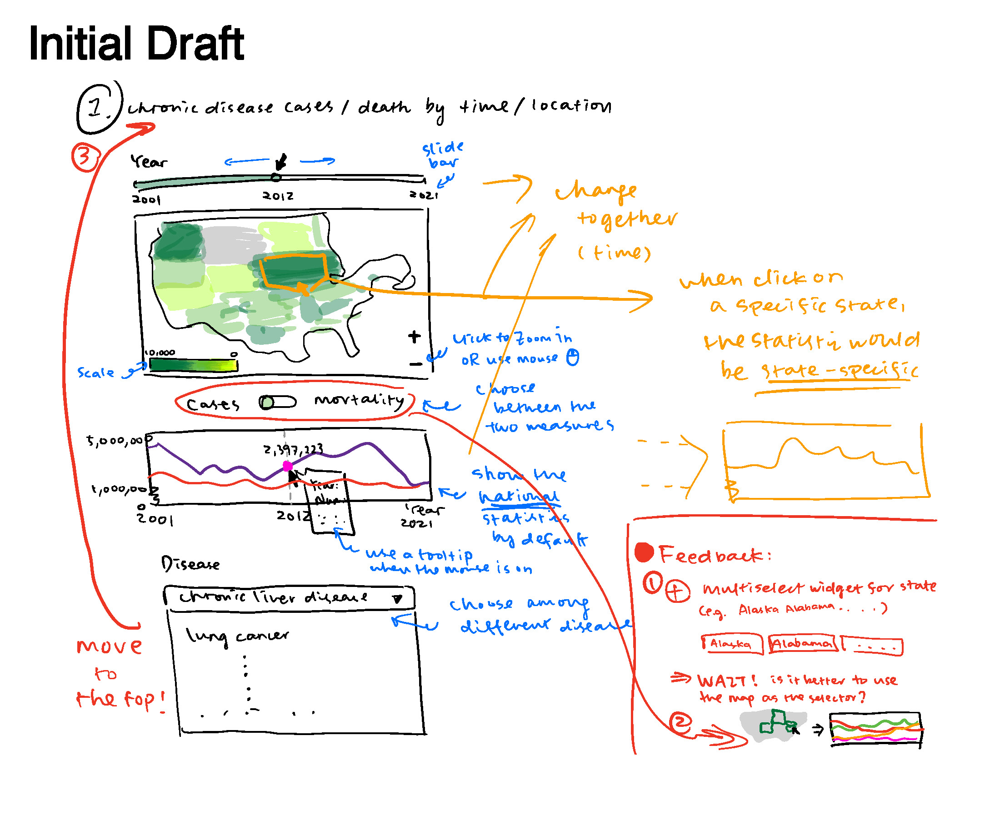
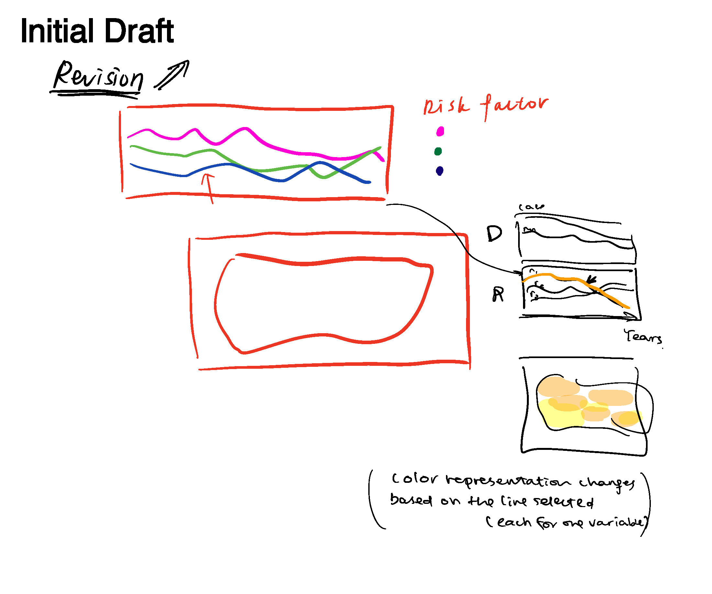

U.S. Chronic Disease Mortality Trend Map
=================
Ziqian Liao
2023-03-09

### About the Project

Project Title: U.S. Chronic Disease Mortality Trend Map

Authors: Ziqian Liao, Joanna Shen

* [GitHub Repository](https://github.com/JiaaiShen/BMI706_Project.git)
* [Streamlit App - U.S. Chronic Disease Mortality Trend Map](https://jiaaishen-bmi706-project-home-3kkj64.streamlit.app/) - Explore our demo! 😎
* [Demo Video - U.S. Chronic Disease Mortality Trend Map](https://github.com/JiaaiShen/BMI706_Project/blob/e6b01c739f0e8aa03ee970ffbfd80f192df0a6cd/bmi706_zl_js_video.mp4)

This is a Streamlit-based visualization project with Chronic Disease Indicators data sourced from CDC. This dataset includes statistics of key significance in public health practice from states and regions across the U.S. over the time span of 2010 - 2022. Two interfaces are included to show (i) the geographical distributions and temporal trends of mortality due to chronic diseases stratified with sex or race/ethnicity and (ii) the associations between mortality due to chronic disease and prevalence of relevant risk factors. 

- - -

## Process Book

### Step 1: Project Proposal

#### 1\. Identification of Dataset

We will be utilizing a publicly available dataset of the U.S. Chronic Disease Indicators (CDI), sourced from the Division of Population Health at the Centers for Disease Control and Prevention (CDC) [1]. This comprehensive dataset includes chronic disease data pertaining to key areas of public health practice as reported by U.S. states and territories via the Behavioral Risk Factor Surveillance System (BRFSS). The dataset consists of an extensive array of time-labeled chronic disease prevalence statistics and data on relevant risk factors. (e.g., asthma mortality rate and sale of cigarette packs) The abundance of entities and observations, along with the potential for identifying associations between variables, made the dataset an ideal subject for exploration and visual presentation.

#### 2\. Data Summary

The CDI dataset is a comprehensive collection of reported statistics spanning a time frame of 2001 to 2021, sourced from a total of 54 states and territories across the United States. Comprising 1,185,676 entries and 34 attributes, this dataset includes responses to 203 unique public health questions, with a majority of the responses stratified according to gender and race/ethnicity.

Here is a sample of the range of topics covered by this dataset, including but not limited to:

* Asthma prevalence and mortality rates
* Various types of cancer prevalence and mortality rates
* Melanoma prevalence and mortality rates
* Hospitalization rates for chronic obstructive pulmonary disease
* Alcohol use patterns across different age groups
* Obesity prevalence rates among different populations
* And more.

Given the extensive availability of quantitative and qualitative data labeled with both time and location, we will carefully select those elements that demonstrate the potential for establishing associations or inferring causality and thus be of significance in advising public health practices.

#### 3\. Exploratory Analysis

Through exploratory analysis of this dataset, we aim to show temporal and spatial patterns that can be found in the statistics related to different kinds of chronic diseases such as obesity, arthritis, chronic lung disease, and so on. This will allow us to present visual information on the changes in trends associated with these types of chronic diseases, which are the leading causes of death and disability in the United States and leading drivers of the nation’s healthcare costs. In the end, we hope to find out the most common characteristics among different types of chronic diseases.

#### 4\. Target Audience

Our main goal is to produce visualizations that can raise awareness of chronic diseases and correlating factors and reduce the burden on the healthcare system. This visualization targets the general population so as to provide them with a more comprehensive and detailed overview of how chronic diseases develop in the United States, healthcare providers so as to prepare them for upcoming treatment of chronic disease, and policy makers who focus on public health so that they can make evidence-based decisions in the future.

#### 5\. Visualization Tasks

The main tasks for this exploratory visualization are as follows:

* Temporal chronic liver disease cases and deaths per state
* Relating alcohol use, poverty, and physical activity to different kinds of cancer cases and deaths
* Relating cigarette use and tobacco-related laws to asthma deaths
* Relating obesity among high school students to whether they are allowed to purchase soda or fruit drinks their computer use, and other behavior
* And more.

**References**

1. Centers for Disease Control and Prevention. (2021). U.S. Chronic Disease Indicators. CDC Division of Population Health. Retrieved February 16, 2023, from https://chronicdata.cdc.gov/Chronic-Disease-Indicators/U-S-Chronic-Disease-Indicators-CDI-/g4ie-h725

- - -

### Step 2: Sketches

#### Potential Visualization Challenges

1. Our goal is to provide a feature that enables users to compare statistics across multiple states. However, the challenge we face is that each state has a set of statistics related to risk factors which already constitutes multiple lines in the plot. To ensure clarity and avoid confusion in the line plot, we have decided to separate these two functionalities. By doing so, we can ensure that the representation of data is clear and unambiguous.
2. We aspire to use the U.S. map as a selector to enable users to retrieve information about a specific region by simply clicking on it. While this design presents exciting possibilities, we are still working on figuring out the best way to implement it.
3. Our objective is to offer users the ability to view statistics related to various risk factors simultaneously. However, we recognize that the difference in numbers across these factors can be substantial, potentially resulting in an ineffective representation if they are displayed on the same scale. In such a scenario, the yaxis may become compressed and make it difficult for users to interpret the data accurately. As a solution, we are exploring the use of a dual-axis or normalization technique to allow for the proper representation of data across different scales, enabling users to compare and analyze statistics effectively.

#### Implementation and Interaction Design

We are developing two distinct functionalities that will be presented on two separate web pages:

(a) The first feature will showcase the trend of disease statistics, including cases and mortality. Additionally,
users will have access to a plot with stratification based on sex, age group, and ethnicity.

(b) The second feature will enable users to view the trend of disease statistics alongside a set of potential risk
factors relevant to the disease. This will provide users with an informative overview of the relationship between the disease and its associated risk factors.

The layout of the two web pages is primarily similar, with only minor differences.

**Page A** includes the following components:

On the left -
(i) A dropdown selector to choose the desired disease type
(ii) A selector to switch between viewing cases or mortality statistics
(iii) A map of the U.S. that displays different regions with the selected statistics represented in color, plus an interactive tooltip.
(iv) A time slider bar that allows users to filter the data for a specific year, which is then displayed on the map.

On the right -
(i) A line plot that displays the trend of the selected statistic over time.
(ii) A second line plot that shows the trend of the selected statistic over time, stratified by one of three variables that the user may select using a selector.

Users will also be able to closely examine the data for a specific region by clicking on the corresponding location on the map. Additionally, while the trend plots display national statistics by default, they will automatically update to show the data for the selected region in the event of a user click.

**Page B** has a unique multi-selector of risk factors, allowing users to choose a subset from all suggested potentially relevant risk factors for the selected disease based on their individual interests. Unlike Page A, there is no stratified trend plot. Instead, there will be a trend plot that displays the data of currently tracked risk factors.

This view provides users with the convenience to compare the trends and discover any relationship that might be hidden. Moreover, users can change the information represented in the map by selecting a specific risk factor they are interested in. This feature enables users to modify the information conveyed by colors on the map and thus provides a more holistic view on geospatial differences.

- - -

### Step 3: Final Deliverables

#### Sample Observations

**Interface I**

* Health data collection appears to be a source of bias, as some ethnic groups, such as *American Indian or Alaska Native* and *Black, non-Hispanic*, have significantly more missing data than others, like *White, non-Hispanic*. This unequal distribution of missing data has resulted in limited knowledge of the health conditions of underrepresented groups, which could further lead to health outcome disparities. We as public health practitioners will need to be aware of such discrepancy.

* Based on the visualization, it is generally observed that males are more susceptible to chronic liver disease, oral cavity and pharynx cancer, cancer of the colon and rectum, lung and bronchus cancer, end-stage renal disease, and coronary heart disease. Females are more prone to asthma, while stroke affects both genders at a similar level.

**Interface II**

* Except for the amount of per capita alcohol consumption, we can learn from the map that th residents of the South Central states, such as Louisiana and Mississippi, may be at higher risk of certain diseases given their prevalence of each of the other three risk factors. Besides, based on the line chart below, among the four risk factors we take into consideration, the amount of per capita alcohol consumption does not change much over time in nearly all the states, while we can clearly see that there are increasing trend in the prevalence of obesity over time and decreasing trend in the prevalence of smoking or healthy weight.

* Based on the two line charts, there exist clear relationships between certain dieases and risk factors. We find that, for instance,
    - Obesity may be a risk factor for chronic liver disease while for individuals with healthy weight, they may be at lower risk of chronic liver disease.
    - Smoking may be a risk factor for colorectal cancer, lung and bronchus cancer, melanoma, or coronary heart disease.

#### Future Work
* We expect additional data on various types of chronic diseases and risk factors to be included in the visualization to obtain a more holistic view in future updates.

* We expect not only the mortality  statistics, but also case data to be included in the visualization in future updates. This may require combining datasets from other sources with existing tables. 

* We expect that the visualization would include demonstrations of the correlation between risk factors and diseases, relying on domain knowledge in future updates. This could necessitate consulting public health experts with specialized knowledge.
